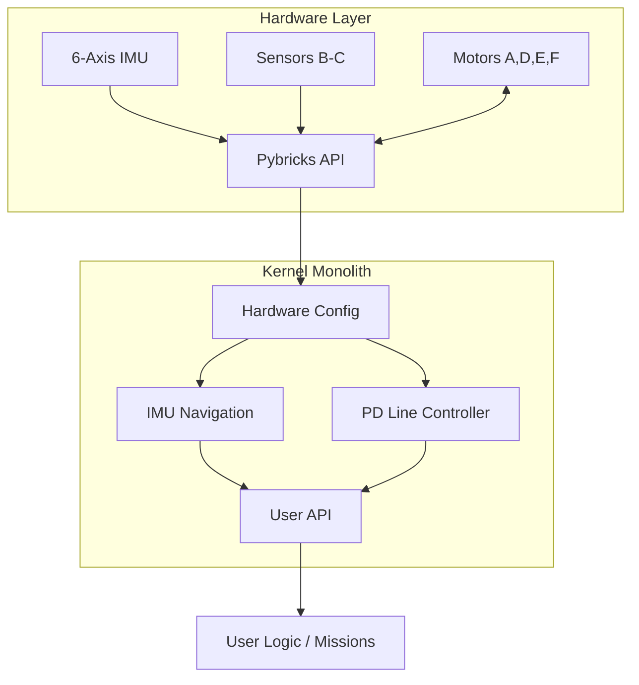

# SPIKE High-Performance Robotics Kernel

<div align="center">
  
  <br><br>
  <a href="https://github.com/tiw302/spikekernel/actions/workflows/lint.yml"></a>
  
  
  
  <a href="LICENSE"></a>
  
</div>

### Engineering Whitepaper & System Documentation

**English** | [ภาษาไทย](README_TH.md)

> [!NOTE]
> **Project Heritage**
> The core concepts and mathematical control theories in this project were **not invented from scratch for SPIKE**. This project is the spiritual successor to **[ev3kernel](https://github.com/tiw302/ev3kernel)**. We have taken the battle-tested code and rewritten it from the ground up to leverage the modern capabilities of the SPIKE Prime hub (specifically the built-in 6-axis IMU) while retaining the zero-allocation memory optimization techniques from the EV3 version.

---

## Technical Objectives

Programming robots for World Robot Olympiad (WRO) requires high precision and stability. Standard LEGO software and basic MicroPython classes can introduce latency and memory fragmentation, causing the robot to behave unpredictably during critical runs. 

`spikekernel` resolves this by utilizing a **Zero-Allocation Monolithic Architecture**:
* **IMU-Fused Navigation:** Replaces encoder-based dead reckoning with absolute heading-locked driving using the hub's onboard 6-axis IMU.
* **Dual-Sensor PD-Straddle Tracking:** Advanced Proportional-Derivative (PD) line following using two color sensors.
* **Elimination of Wheel Slip:** Implementation of Trapezoidal Velocity Profiles to ensure tires maintain static friction.
* **Deterministic Execution:** Achieving a zero-allocation hot loop to prevent Garbage Collection (GC) pauses.
* **Minimal Memory Footprint:** Consolidating the architecture into a highly optimized single-file monolith to maximize available RAM.

---

## Table of Contents
- **Core Concepts**
  - [Hardware Requirements](#hardware-requirements)
  - [Repository Structure](#repository-structure)
  - [Quick Start](#quick-start--installation)
  - [Navigation Theory & Mathematics](#navigation-theory--mathematics)
- **System Core**
  - [System Architecture](#system-architecture)
  - [Performance Optimization](#performance-optimization)
- **Navigation & Control**
  - [Drive & Navigation System](#1-drive--navigation)
  - [Line Tracking & Perception](#2-line-tracking--perception)
- **Resources**
  - [Pre-match Checklist](#pre-match-checklist)
  - [API Reference](#api-reference)

---

## Hardware Requirements
This kernel is optimized for a SPIKE Prime WRO setup:
*   **Hub:** LEGO Education SPIKE Prime Hub (or Robot Inventor Hub)
*   **Drive:** 2x Medium Motors (Ports D & E)
*   **Attachments:** 2x Medium/Large Motors (Ports A & F)
*   **Sensor Array:** 2x Color Sensors (Ports B & C) configured for dual-sensor straddle tracking.

## Repository Structure
*   `main.py` - The core monolith kernel.
*   `debug.py` - A diagnostic script to read and tune sensor values in real-time.

---

## Quick Start
The entire kernel is contained within a single `main.py` file to minimize RAM fragmentation and import overhead. Mission logic is written directly at the bottom of the file to comply with WRO "One-Touch" rules.

```python
# 1. Smoothly accelerate, drive 50cm keeping IMU heading at 0 degrees
robot.move_straight(50, max_speed=50)

# 2. Precision IMU point-turn to exactly 90 degrees
robot.turn(90, max_speed=40)

# 3. High-speed dual-sensor PD line follow
robot.track_line(speed=40, kp=0.8, kd=0.1)
```

## System Architecture
This framework strictly adheres to a **MicroPython Monolith (Single-File) Model**. 



*   **[main.py](./main.py)**: The unified kernel containing hardware abstraction, math libraries, and the user-space execution block.
*   **[debug.py](./debug.py)**: A standalone diagnostic tool run directly on the competition mat to calibrate light sensors and verify IMU drift.

---

## Hardware Configuration (Wiring)
This kernel expects a standardized hardware layout to ensure optimal geometry calculation.

<div align="center">
  
</div>

*   **Drive Motors:** Ports D (Left) & E (Right)
*   **Attachment Motors:** Ports A (Front) & F (Rear/Main)
*   **Color Sensors:** Ports B (Left) & C (Right)

---

## Quick Start & Installation

1. **Firmware Setup:** This kernel bypasses the stock LEGO firmware. You must install the **[Pybricks 4.0 firmware](https://beta.pybricks.com/)**.
2. **Execution Workflow:**
   * Write and maintain your code locally using **VS Code**.
   * When ready to run, copy and paste the code into the [Pybricks Beta Web IDE](https://beta.pybricks.com/) and execute it.
3. **Deployment:** 
   * Upload `main.py` as your primary competition script.
   * Keep `debug.py` on the hub in a separate slot to run hardware diagnostics before matches.

---

## API Reference

### 1. Drive & Navigation
| Function | Parameters | Description |
|---|---|---|
| `move_straight` | `distance_cm, max_speed` | Move straight using Trapezoidal velocity profiling and IMU heading lock. |
| `turn` | `target_angle, max_speed` | Point turn to an absolute IMU angle using Proportional control. |
| `pivot_turn` | `target_angle, pivot_side` | Pivot turn by locking one wheel (`'left'` or `'right'`). |
| `stop_drive` | `hold=True/False` | Immediately brake and actively hold the wheel position. |

### 2. Line Tracking & Perception
| Function | Parameters | Description |
|---|---|---|
| `drive_until_line` | `speed, align=True` | Drive forward until a line is detected, optionally auto-squaring against it. |
| `align_line` | `time_ms` | Square the robot against a transverse black line using dual light sensors. |
| `track_line` | `speed, kp, kd` | Follows the line using dual-sensor PD control until an intersection is detected. |
| `track_line_distance` | `distance_cm, speed` | Follows the line using PD control for a specific distance. |
| `track_line_timer` | `time_ms, speed` | Follows the line using PD control for a specific amount of time. |
| `normalize` | `raw_value` | Maps raw light reflection to a calibrated `[0, 100]` percentage. |

### 3. Attachments & Grippers
| Function | Parameters | Description |
|---|---|---|
| `lift_a` | `speed, power` | Actuate the front attachment (Port A). |
| `release_a` | *None* | Release holding torque on the front attachment. |
| `lift_f` | `speed, power` | Actuate the main rear attachment (Port F). |
| `release_f` | *None* | Release holding torque on the main attachment. |

---

## Navigation Theory & Mathematics

### 1. IMU-Fused Navigation
Unlike older systems that relied on motor encoders (dead reckoning), `spikekernel` utilizes the SPIKE hub's internal 6-axis IMU to maintain an absolute coordinate system. When calling `move_straight`, the robot actively reads `hub.imu.heading()` and dynamically adjusts motor power to maintain its angle, resisting external pushes or tire slips.

<div align="center">
  
  <p><em>Simulated visualization of IMU-Fused Heading Lock correcting external disturbances automatically.</em></p>
</div>

<details>
<summary><b>[+] View DriveBase Speed Conversion Algorithm (C-Level)</b></summary>

```text
// Convert degrees per second (dps) to millimeters per second (mm/s)
speed_mm = (max_speed / 360.0) * (PI * WHEEL_DIAMETER_MM)

// Convert max_speed to turn_rate (degrees/sec) for point turns
turn_rate = (max_speed * WHEEL_DIAMETER_MM) / AXLE_TRACK_MM
```
</details>

### 2. Inlined PD (Proportional-Derivative) Control
For line tracking, we use an inlined PD controller. Combining the readings of the Left (B) and Right (C) sensors allows the error calculation to be highly sensitive to the robot's orientation.
*   **Derivative on Measurement (Inlined):** Eliminates "derivative kick" and smooths out rapid adjustments.
*   **Active Gyro Dampening:** Incorporates real-time Angular Velocity from the IMU's Z-axis to actively suppress tracking oscillation.
*   **Inlining:** The PD equation is written directly inside the `while` loop, eliminating the overhead of calling external functions during the 1,000Hz cycle.

<div align="center">
  
  <p><em>Simulated response of Dual-Sensor PD rapidly dampening oscillation.</em></p>
</div>

<details>
<summary><b>[+] View Dual-Sensor PD & Gyro Dampening Algorithm</b></summary>

```text
// 1. Calculate error from sensors straddling the line
error = Sensor_Left - Sensor_Right

// 2. Calculate derivative (rate of change)
derivative = error - last_error

// 3. Gyro Dampening (fetch real-time oscillation speed from IMU)
gyro_damp = 0.3 * IMU_Angular_Velocity(Z)

// 4. Compute turn power
turn = (error * Kp) + (derivative * Kd) + gyro_damp

// 5. Output power to motors
Left_Motor_Power = speed + turn
Right_Motor_Power = speed - turn
```
</details>

### 3. Motion Profiling (Trapezoidal Velocity)
Aggressive starts cause wheels to slip, immediately ruining odometry. Our system uses a Trapezoidal S-Curve:
*   **Accel $\rightarrow$ Cruise $\rightarrow$ Decel:** Ensures the tires maintain static friction with the competition mat.

<div align="center">
  
  <p><em>Simulated Trapezoidal S-Curve velocity profile preventing wheel slip during acceleration and deceleration.</em></p>
</div>

<details>
<summary><b>[+] View Trapezoidal Acceleration Algorithm</b></summary>

```text
// Calculate straight acceleration to reach max speed smoothly in 0.5 seconds
straight_acceleration = speed_mm / 0.5

// Calculate turn acceleration to reach max turn rate smoothly in 0.4 seconds
turn_acceleration = turn_rate / 0.4

// Feed parameters into DriveBase for native C-level S-Curve execution
drive_base.settings(straight_acceleration, turn_acceleration)
```
</details>

### 4. Auto-Squaring & Synchronization
To eliminate accumulated error and reset the robot's physical heading mid-run, we employ motor synchronization techniques:
*   **Wall Squaring:** Uses a P-Controller on the left and right wheel encoders (`sync_err = left_angle - right_angle`) to force the wheels to spin at the exact same rate while pushing against a wall. This prevents the robot from twisting or spinning out when stalling.
*   **Line Squaring:** Processes the left and right color sensors independently. When driving towards a transverse line, whichever sensor hits the line first will immediately brake its corresponding motor, while the other motor continues to drive until it also detects the line. This perfectly aligns the robot perpendicular to the line.

<div align="center">
  
  <p><em>Simulated Line Squaring where the left sensor hits the line first and brakes, waiting for the right side to align.</em></p>
</div>

<details>
<summary><b>[+] View Proportional Wall Squaring & Independent Braking Logic</b></summary>

```text
// 1. Proportional Wall Squaring
sync_error = Left_Motor_Angle - Right_Motor_Angle
correction = Kp * sync_error
Left_Motor_Power = Base_Power - correction
Right_Motor_Power = Base_Power + correction

// 2. Independent Line Squaring
if (Left_Sensor_Sees_Black)  -> Stop Left Motor
if (Right_Sensor_Sees_Black) -> Stop Right Motor
```
</details>

---

## Performance Optimization

### Zero-Allocation Hot Loops & Deterministic GC
The most critical vulnerability of MicroPython in competitive robotics is the Garbage Collector (GC). When the system automatically clears memory, the CPU freezes for 5-10ms. If this happens while tracking a line or reading an IMU angle, the robot will jitter, veer off course, or overshoot a turn.

*   All `print()` statements and string concatenations are banned from execution hot loops.
*   **Zero-Jitter Control:** We explicitly call `gc.collect()` to clear memory *before* a movement, and then immediately call `gc.disable()` to freeze the Garbage Collector entirely. This guarantees the control loop executes at maximum frequency without a single jitter. `gc.enable()` is called once the movement safely completes.

### Memory Optimization
We utilize `__slots__` and `micropython.const()` to aggressively compress the RAM footprint. This leaves maximum headroom for the underlying Pybricks RTOS to manage communications and hardware interrupts smoothly.

---

## Pre-match Checklist

1. Update `WHEEL_DIAMETER_MM` and `AXLE_TRACK_MM` in `main.py` to match the physical robot geometry.
2. Place the robot on the mat and run [`debug.py`](./debug.py). Ensure the IMU heading stabilizes at 0 when the robot is perfectly straight.
3. Use `debug.py` to calibrate sensors. Update `BLACK_RAW` / `WHITE_RAW` based on output for the specific lighting conditions of the competition table.
4. Wipe the tires with a damp cloth to guarantee maximum traction.

---

## Hardware Constraints & Known Limitations

1. **IMU Drift:** While the SPIKE IMU is excellent, gyroscopes drift over time. It is recommended to perform a mechanical wall-square or line-square periodically during a 2-minute WRO run to reset the robot's physical heading.
2. **Ambient Light Sensitivity:** Color sensors are sensitive to external lighting (windows, camera flashes). Always recalibrate `BLACK_RAW` and `WHITE_RAW` at the actual competition table.

---

## Final Note: Advice from a WRO Veteran

Software is only part of the solution. Having experienced the pressure of WRO competitions myself, remember:
*   **Wipe your tires constantly:** Dust is the ultimate enemy. If your tires are dusty, they will slip and your turns will be inaccurate.
*   **Check your cables:** Make cable management a habit so nothing snags during a run.
*   **Mistakes are part of the process:** On competition day, the robot might behave differently due to lighting changes or mat friction. Do not panic. Take a deep breath and troubleshoot step by step.
*   **Simplicity is the Ultimate Sophistication:** Keep your logic clean and easy to read.

Winning a robotics competition requires relentless practice and adaptability. This kernel is designed to handle software stability so you can focus on mechanical design and solving the mission. 

---

## Useful Resources & Further Reading
* [Pybricks Official Documentation](https://docs.pybricks.com/)
* [World Robot Olympiad (WRO) Official Rules](https://wro-association.org/)
* [Understanding PID Controllers (Wikipedia)](https://en.wikipedia.org/wiki/Proportional%E2%80%93integral%E2%80%93derivative_controller)

---

## ✉ Support & Contact
If you encounter any issues or have questions about tuning, feel free to reach out:
*   **GitHub Issues:** Open an issue in this repository.
*   **Instagram:** Send a DM on IG at **[@tiw3025k_](https://www.instagram.com/tiw3025k_/)** *(Please follow first so your message doesn't go to spam).*

---

## ✱ Contributors

| Profile | Name / GitHub | Role & Contributions |
| :---: | :--- | :--- |
|  | **[@tiw302](https://github.com/tiw302)** | **Lead Developer & Architect** <br> System architecture, IMU implementation, and memory optimization. |

---

## License
This project is licensed under the [MIT License](LICENSE) - see the [LICENSE](LICENSE) file for details.

<div align="center">
  <strong>Engineered for Victory.</strong><br>
  <em>World Robot Olympiad Competition Framework</em>
</div>
