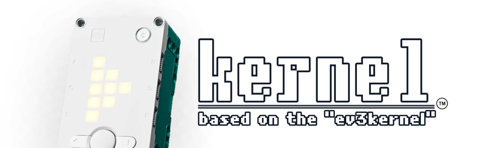
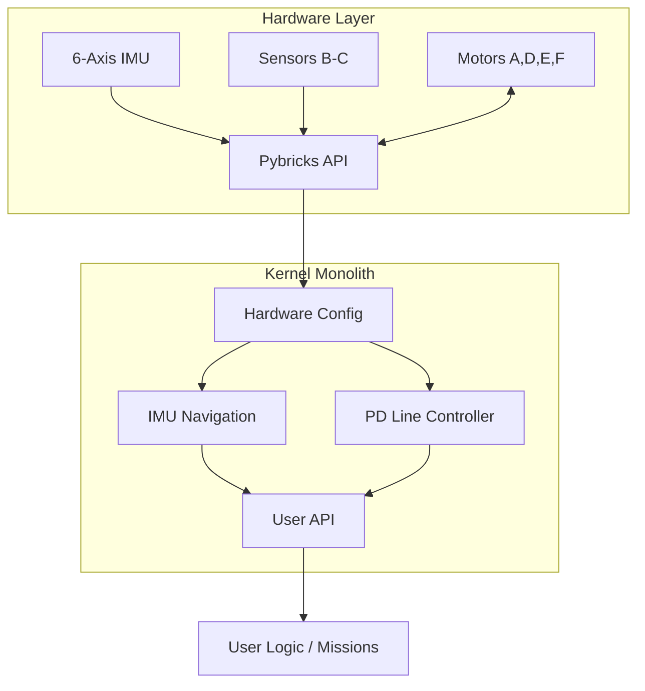
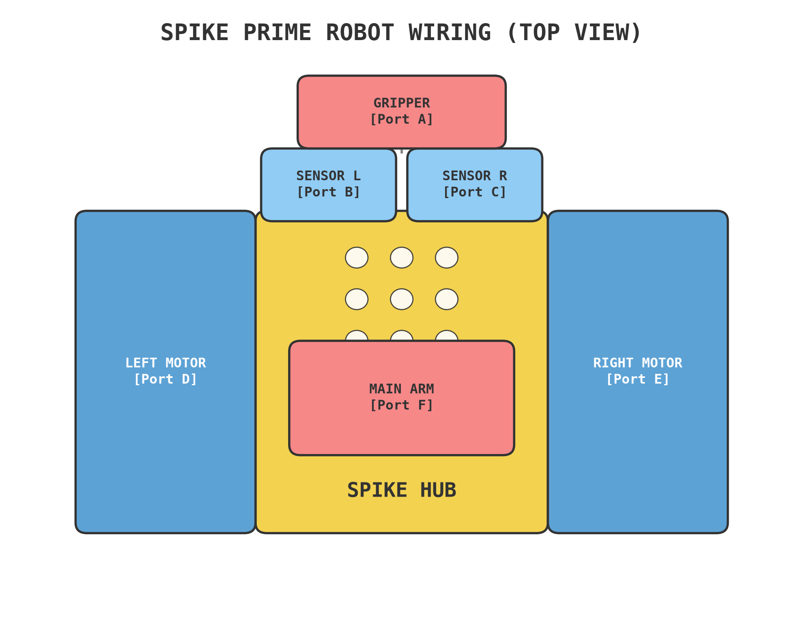
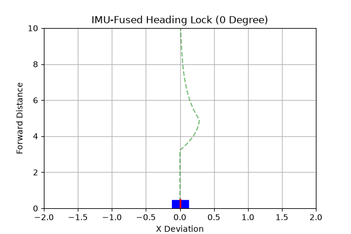
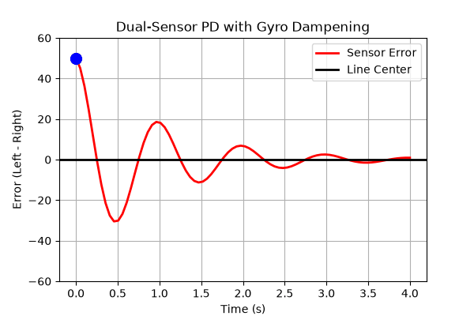
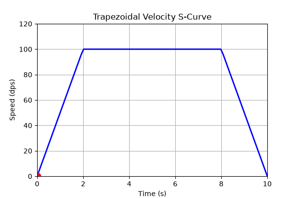

# SPIKE High-Performance Robotics Kernel

<div align="center">
  
  <br><br>
  <a href="https://github.com/tiw302/spikekernel/actions/workflows/lint.yml"></a>
  
  
  
  <a href="LICENSE"></a>
  
</div>

### เอกสารเชิงวิศวกรรมและคู่มือระบบ (Engineering Whitepaper & System Documentation)

[English](README.md) | **ภาษาไทย**

> [!NOTE]
> **ที่มาของโปรเจกต์**
> แนวคิดหลักและทฤษฎีการควบคุมในโปรเจกต์นี้ไม่ได้ถูกคิดขึ้นใหม่ทั้งหมด แต่เป็นการพัฒนาต่อยอดและสืบทอดมาจาก **[ev3kernel](https://github.com/tiw302/ev3kernel)** โดยถูกนำมาปรับปรุงและเขียนขึ้นใหม่เพื่อนำความสามารถของบอร์ด SPIKE Prime (โดยเฉพาะเซ็นเซอร์ IMU 6 แกนที่ติดตั้งมาในตัว) มาใช้งานอย่างเต็มประสิทธิภาพ ในขณะที่ยังคงเทคนิคการจัดการหน่วยความจำแบบ Zero-Allocation อันเป็นหัวใจสำคัญที่ทำให้โค้ดมีความเสถียร

---

## วัตถุประสงค์ทางเทคนิค (Technical Objectives)

การเขียนโปรแกรมหุ่นยนต์สำหรับการแข่งขัน World Robot Olympiad (WRO) ต้องการความแม่นยำและเสถียรภาพระดับสูงสุด ซอฟต์แวร์มาตรฐานและคลาสพื้นฐานของ MicroPython มักจะก่อให้เกิดความหน่วง (Latency) และปัญหาการกระจายตัวของหน่วยความจำ (Memory Fragmentation) ซึ่งส่งผลให้หุ่นยนต์เกิดอาการทำงานผิดพลาดแบบสุ่มในช่วงเวลาที่สำคัญที่สุด

`spikekernel` แก้ปัญหานี้โดยการใช้ **สถาปัตยกรรมแบบไฟล์เดียว (Zero-Allocation Monolith Architecture)**:
* **การนำทางด้วย IMU 6 แกน:** ยกเลิกการคำนวณระยะทางจากล้อ (Encoder Dead Reckoning) และเปลี่ยนมาควบคุมองศาแบบสัมบูรณ์ (Absolute Heading) โดยใช้ IMU ที่ฝังอยู่ในบอร์ด SPIKE
* **การเดินตามเส้นแบบ Dual-Sensor PD-Straddle:** ใช้สมการ Proportional-Derivative (PD) ระดับสูงพร้อมเซ็นเซอร์สี 2 ตัว
* **การลดอาการล้อฟรี (Wheel Slip):** ใช้สมการความเร็วแบบสี่เหลี่ยมคางหมู (Trapezoidal Velocity Profiles) เพื่อรักษาแรงเสียดทานสถิต
* **การประมวลผลแบบเสถียร 100%:** ใช้โครงสร้าง Hot Loop แบบไม่มีการจองหน่วยความจำใหม่ (Zero-Allocation) เพื่อหลีกเลี่ยงกระบวนการลบขยะ (Garbage Collection หรือ GC)
* **ใช้ RAM น้อยที่สุด:** รวบรวมระบบทั้งหมดไว้ในไฟล์เดียวที่มีขนาดเล็กมาก เพื่อสงวนพื้นที่ RAM ให้มากที่สุด

---

## สารบัญ (Table of Contents)
- **แนวคิดหลัก**
  - [ฮาร์ดแวร์ที่รองรับ (Hardware Requirements)](#ฮาร์ดแวร์ที่รองรับ-hardware-requirements)
  - [โครงสร้างพื้นที่เก็บข้อมูล (Repository Structure)](#โครงสร้างพื้นที่เก็บข้อมูล-repository-structure)
  - [เริ่มต้นใช้งานด่วน (Quick Start)](#การติดตั้งและใช้งาน-quick-start--installation)
  - [หลักการทางคณิตศาสตร์และทฤษฎีการเดินรถ](#ทฤษฎีการเคลื่อนที่และคณิตศาสตร์-navigation-theory)
- **ระบบควบคุมกลาง**
  - [สถาปัตยกรรมระบบ (System Architecture)](#สถาปัตยกรรมระบบ-system-architecture)
  - [การเพิ่มประสิทธิภาพ (Performance Optimization)](#การเพิ่มประสิทธิภาพ-performance-optimization)
- **การเคลื่อนที่**
  - [ระบบขับเคลื่อนและการนำทาง](#1-การเคลื่อนที่-drive--navigation)
  - [การเกาะเส้นและประมวลผลเซนเซอร์](#2-การอ่านค่าเซ็นเซอร์และเดินตามเส้น-line-tracking--perception)
- **ข้อมูลอ้างอิง**
  - [การเตรียมตัวก่อนแข่ง (Pre-match Checklist)](#รายการตรวจสอบก่อนแข่ง-pre-match-checklist)
  - [ข้อมูลอ้างอิง API (API Reference)](#คู่มือคำสั่ง-api-reference)

---

## ฮาร์ดแวร์ที่รองรับ (Hardware Requirements)
เคอร์เนลนี้ถูกปรับแต่งมาเป็นพิเศษสำหรับการต่อหุ่นยนต์ SPIKE Prime เพื่อการแข่งขัน WRO:
*   **บอร์ด (Hub):** LEGO Education SPIKE Prime Hub (หรือ Robot Inventor Hub)
*   **ล้อขับเคลื่อน (Drive):** มอเตอร์ขนาดกลาง 2 ตัว (พอร์ต D & E)
*   **แขนกล (Attachments):** มอเตอร์ขนาดกลาง/ใหญ่ 2 ตัว (พอร์ต A & F)
*   **เซ็นเซอร์ (Sensor Array):** เซ็นเซอร์สี 2 ตัว (พอร์ต B & C) สำหรับเดินตามเส้นแบบคร่อมเส้น

## โครงสร้างพื้นที่เก็บข้อมูล (Repository Structure)
*   `main.py` - โค้ดแกนกลางทั้งหมดรวมอยู่ในไฟล์เดียว
*   `debug.py` - สคริปต์หน้าปัดสำหรับอ่านค่าและจูนเซ็นเซอร์แบบเรียลไทม์ผ่านหน้าจอ LED ของบอร์ด

---

## เริ่มต้นใช้งานด่วน (Quick Start)
ระบบทั้งหมดถูกเก็บไว้ในไฟล์ `main.py` เพียงไฟล์เดียว เพื่อลดปัญหา Memory Fragmentation และความหน่วงจากการ Import โดยลอจิกของการทำภารกิจจะถูกเขียนไว้ที่ด้านล่างสุดของไฟล์ เพื่อให้เป็นไปตามกฎ "รันสัมผัสเดียว" (One-Touch) ของ WRO

```python
# 1. เร่งความเร็วแบบนุ่มนวล วิ่งตรง 50 ซม. โดยล็อคองศา IMU ไว้ที่ 0 องศา
robot.move_straight(50, max_speed=50)

# 2. เลี้ยวด้วยความแม่นยำสูงแบบล็อคองศาสัมบูรณ์ด้วย IMU ไปที่ 90 องศา
robot.turn(90, max_speed=40)

# 3. เดินตามเส้นความเร็วสูงด้วยระบบ Dual-Sensor PD
robot.track_line(speed=40, kp=0.8, kd=0.1)
```

## สถาปัตยกรรมระบบ (System Architecture)
เฟรมเวิร์กนี้ยึดหลัก **MicroPython Monolith (Single-File) Model** อย่างเคร่งครัด



*   **[main.py](./main.py)**: เคอร์เนลหลักที่รวมการตั้งค่าฮาร์ดแวร์ ไลบรารีคณิตศาสตร์ และบล็อกคำสั่งของผู้ใช้
*   **[debug.py](./debug.py)**: เครื่องมือวินิจฉัยแบบสแตนด์อะโลน สำหรับรันบนโต๊ะแข่งขันเพื่อคาริเบรทเซ็นเซอร์และตรวจสอบการคลาดเคลื่อนของ IMU

---

## การตั้งค่าฮาร์ดแวร์และการต่อสาย (Hardware Configuration)
เคอร์เนลนี้คาดหวังการต่อสายตามมาตรฐานที่กำหนด เพื่อให้การคำนวณมิติของหุ่นยนต์ทำงานได้อย่างสมบูรณ์

<div align="center">
  
</div>

*   **มอเตอร์ขับเคลื่อน:** พอร์ต D (ซ้าย) & E (ขวา)
*   **มอเตอร์แขนกล:** พอร์ต A (หน้า) & F (หลัง/หลัก)
*   **เซ็นเซอร์สี:** พอร์ต B (ซ้าย) & C (ขวา)

---

## การติดตั้งและใช้งาน (Quick Start & Installation)

1. **ติดตั้งเฟิร์มแวร์:** เคอร์เนลนี้ไม่ใช้เฟิร์มแวร์เดิมของ LEGO คุณต้องติดตั้ง **[Pybricks 4.0 firmware](https://beta.pybricks.com/)** ลงบน SPIKE Hub ของคุณ
2. **ขั้นตอนการเขียนโค้ด:**
   * เขียนและจัดระเบียบโค้ดของคุณในคอมพิวเตอร์ผ่าน **VS Code**
   * เมื่อพร้อมทดสอบ ให้คัดลอกโค้ดทั้งหมดไปวางใน [Pybricks Beta Web IDE](https://beta.pybricks.com/) และสั่งรัน
3. **การใช้งานวันแข่ง:** 
   * อัปโหลด `main.py` เพื่อใช้รันทำภารกิจหลัก
   * อัปโหลด `debug.py` ไว้ในอีกสล็อตของบอร์ด เพื่อใช้ทดสอบฮาร์ดแวร์ก่อนลงสนามจริง

---

## คู่มือคำสั่ง (API Reference)

### 1. การเคลื่อนที่ (Drive & Navigation)
| คำสั่ง | พารามิเตอร์ | คำอธิบาย |
|---|---|---|
| `move_straight` | `distance_cm, max_speed` | วิ่งตรงโดยใช้ความเร็วแบบสี่เหลี่ยมคางหมู และล็อคองศาด้วย IMU |
| `turn` | `target_angle, max_speed` | หมุนตัวอยู่กับที่ (Point turn) ไปยังองศาเป้าหมายตามค่า IMU โดยใช้ Proportional control |
| `pivot_turn` | `target_angle, pivot_side` | เลี้ยววงกว้างโดยล็อกล้อข้างใดข้างหนึ่ง (`'left'` หรือ `'right'`) |
| `stop_drive` | `hold=True/False` | เบรกทันทีและเกร็งมอเตอร์รักษาระยะ (Hold) |

### 2. การอ่านค่าเซ็นเซอร์และเดินตามเส้น (Line Tracking & Perception)
| คำสั่ง | พารามิเตอร์ | คำอธิบาย |
|---|---|---|
| `drive_until_line` | `speed, align=True` | วิ่งตรงไปจนกว่าจะเจอเส้นทึบ และมีตัวเลือกให้ปรับหน้าหุ่นเข้าหาเส้น (Square) |
| `align_line` | `time_ms` | ใช้เซ็นเซอร์สองตัวเช็คหน้าหุ่นให้ขนานกับเส้นขวาง |
| `track_line` | `speed, kp, kd` | เดินตามเส้นด้วยสมการ Dual-sensor PD ไปจนกว่าจะเจอทางแยก |
| `track_line_distance` | `distance_cm, speed` | เดินตามเส้นด้วย PD ตามระยะทางที่กำหนด |
| `track_line_timer` | `time_ms, speed` | เดินตามเส้นด้วย PD ตามเวลาที่กำหนด |
| `normalize` | `raw_value` | แปลงค่าแสงที่อ่านได้ดิบๆ ให้อยู่ในสเกลเปอร์เซ็นต์ `[0, 100]` |

### 3. แขนกล (Attachments & Grippers)
| คำสั่ง | พารามิเตอร์ | คำอธิบาย |
|---|---|---|
| `lift_a` | `speed, power` | ขยับแขนกลด้านหน้า (พอร์ต A) |
| `release_a` | *ไม่มี* | ปลดแรงเกร็งของมอเตอร์พอร์ต A |
| `lift_f` | `speed, power` | ขยับแขนกลหลักด้านหลัง (พอร์ต F) |
| `release_f` | *ไม่มี* | ปลดแรงเกร็งของมอเตอร์พอร์ต F |

---

## ทฤษฎีการเคลื่อนที่และคณิตศาสตร์ (Navigation Theory)

### 1. การนำทางด้วย IMU-Fused
ต่างจากระบบ EV3 รุ่นเก่าที่พึ่งพาการคำนวณรอบล้อหมุน (Dead Reckoning) อย่างเดียว `spikekernel` เลือกใช้ IMU 6 แกนภายในบอร์ด SPIKE เพื่อสร้างระบบพิกัดสัมบูรณ์ (Absolute Coordinate System) เมื่อสั่ง `move_straight` หุ่นยนต์จะอ่านค่า `hub.imu.heading()` ตลอดเวลาและปรับพลังมอเตอร์แบบไดนามิกเพื่อรักษาองศาให้ตรง แม้จะถูกชนหรือล้อฟรีลื่นไถลก็ตาม

<div align="center">
  
  <p><em>ภาพจำลองการทำงานของ IMU-Fused Heading Lock ที่แก้ไขการเบี่ยงเบนขององศาให้กลับมาตรงโดยอัตโนมัติ</em></p>
</div>

<details>
<summary><b>[+] ดูสมการแปลงความเร็วสำหรับ DriveBase (C-Level)</b></summary>

```text
// แปลงจากองศาต่อวินาที (dps) เป็นมิลลิเมตรต่อวินาที (mm/s)
speed_mm = (max_speed / 360.0) * (PI * WHEEL_DIAMETER_MM)

// แปลงความเร็วเป็นอัตราการหมุนตัว (องศาต่อวินาที) สำหรับการเลี้ยว
turn_rate = (max_speed * WHEEL_DIAMETER_MM) / AXLE_TRACK_MM
```
</details>

### 2. ระบบควบคุม PD แบบแทรกในลูป (Inlined PD Control)
สำหรับการเดินตามเส้น เราใช้ตัวควบคุม PD แบบฝังโค้ด (Inlined) การนำค่าเซ็นเซอร์ซ้าย (B) และขวา (C) มาคำนวณร่วมกัน ทำให้ระบบตอบสนองต่อมุมเอียงของหุ่นยนต์ได้อย่างแม่นยำ
*   **Derivative on Measurement (Inlined):** ป้องกันอาการกระชาก (Derivative Kick) ทำให้การปรับแต่งค่าลื่นไหลขึ้น
*   **Active Gyro Dampening:** นำค่าความเร็วเชิงมุม (Angular Velocity) จาก IMU แกน Z มาหักล้างอาการส่ายของหุ่นยนต์แบบเรียลไทม์
*   **Inlining:** สมการ PD ถูกเขียนไว้ภายในลูป `while` โดยตรง ตัดปัญหาความหน่วงจากการเรียกใช้ฟังก์ชันภายนอก

<div align="center">
  
  <p><em>ภาพจำลองการตอบสนองของระบบ Dual-Sensor PD ที่แก้อาการส่ายได้อย่างรวดเร็วและนุ่มนวล</em></p>
</div>

<details>
<summary><b>[+] ดูสมการ Dual-Sensor PD และ Gyro Dampening</b></summary>

```text
// 1. หาค่า Error จากเซ็นเซอร์สองตัวคร่อมเส้น
error = Sensor_Left - Sensor_Right

// 2. หาค่าความเปลี่ยนแปลง (Derivative)
derivative = error - last_error

// 3. Gyro Dampening (ดึงค่าการส่ายจาก IMU)
gyro_damp = 0.3 * IMU_Angular_Velocity(Z)

// 4. คำนวณพลังที่ใช้เลี้ยว
turn = (error * Kp) + (derivative * Kd) + gyro_damp

// 5. สั่งจ่ายไฟเข้ามอเตอร์
Left_Motor_Power = speed + turn
Right_Motor_Power = speed - turn
```
</details>

### 3. รูปแบบความเร็วสี่เหลี่ยมคางหมู (Trapezoidal Velocity)
การออกตัวอย่างรุนแรงทำให้ล้อลื่นไถลและทำให้องศาผิดเพี้ยนทันที ระบบของเราใช้เส้นโค้ง S-Curve แบบสี่เหลี่ยมคางหมู:
*   **เร่งความเร็ว $\rightarrow$ วิ่งคงที่ $\rightarrow$ ลดความเร็ว:** เพื่อให้แน่ใจว่ายางจะรักษาแรงเสียดทานสถิตกับพื้นสนามไว้ได้ตลอดเวลา

<div align="center">
  
  <p><em>กราฟจำลองความเร็ว S-Curve ป้องกันล้อฟรีตอนออกตัวและเบรก</em></p>
</div>

<details>
<summary><b>[+] ดูสมการคำนวณความเร่งแบบสี่เหลี่ยมคางหมู</b></summary>

```text
// คำนวณอัตราเร่ง (Acceleration) เพื่อให้ไต่ระดับถึงความเร็วสูงสุดภายใน 0.5 วินาที
straight_acceleration = speed_mm / 0.5

// คำนวณอัตราเร่งตอนเลี้ยว (Turn Acceleration) เพื่อให้ถึงความเร็วเลี้ยวสูงสุดใน 0.4 วินาที
turn_acceleration = turn_rate / 0.4

// ป้อนค่าให้ DriveBase ควบคุม S-Curve ในระดับเฟิร์มแวร์
drive_base.settings(straight_acceleration, turn_acceleration)
```
</details>

### 4. การตั้งลำและจัดระเบียบหุ่นอัตโนมัติ (Auto-Squaring & Synchronization)
เพื่อแก้ปัญหาการวางหุ่นเอียง หรือการสะสมค่าความคลาดเคลื่อนกลางสนาม เราใช้เทคนิคการซิงค์มอเตอร์เพื่อรีเซ็ตองศา (Heading Reset):
*   **Wall Squaring (ชนกำแพงตั้งลำ):** ใช้ P-Controller ควบคุมค่าองศาล้อ (Encoder) ซ้ายและขวาให้เท่ากันตลอดเวลาขณะขับชนกำแพง (`sync_err = left_angle - right_angle`) ป้องกันไม่ให้หุ่นบิดตัวเมื่อเกิดอาการมอเตอร์หยุดชะงัก (Stall)
*   **Line Squaring (จัดหน้ากระดานด้วยเส้นขวาง):** อ่านเซ็นเซอร์สีซ้าย-ขวาอย่างเป็นอิสระต่อกัน ล้อข้างที่เซ็นเซอร์เจอเส้นดำก่อนจะหยุดและล็อกทันที ในขณะที่ล้ออีกข้างจะหมุนต่อไปจนกว่าจะเจอเส้น ทำให้หุ่นปรับหน้ากระดานตั้งฉากกับเส้นแบบ 100% กลางสนาม

<div align="center">
  
  <p><em>กราฟจำลองการทำ Line Squaring ล้อซ้ายชนเส้นและเบรกก่อน ปล่อยล้อขวาเดินต่อจนกว่าหุ่นจะขนานกับเส้นขวาง</em></p>
</div>

<details>
<summary><b>[+] ดูลอจิก P-Controller การชนกำแพงและเบรกอิสระ</b></summary>

```text
// 1. Proportional Wall Squaring
sync_error = Left_Motor_Angle - Right_Motor_Angle
correction = Kp * sync_error
Left_Motor_Power = Base_Power - correction
Right_Motor_Power = Base_Power + correction

// 2. Independent Line Squaring
if (Left_Sensor_Sees_Black)  -> Stop Left Motor
if (Right_Sensor_Sees_Black) -> Stop Right Motor
```
</details>

---

## การเพิ่มประสิทธิภาพ (Performance Optimization)

### ลูปการประมวลผลแบบ Zero-Allocation และการปิด GC
จุดอ่อนร้ายแรงที่สุดของ MicroPython ในการแข่งหุ่นยนต์คือ Garbage Collector (GC) เมื่อระบบล้างหน่วยความจำอัตโนมัติ CPU จะหยุดทำงานไปชั่วขณะ 5-10ms หากเหตุการณ์นี้เกิดขึ้นขณะหุ่นยนต์กำลังอ่านเส้นหรืออ่านค่า IMU หุ่นยนต์จะกระตุก เบี่ยงออกนอกเส้นทาง หรือเลี้ยวเกินเป้าหมาย

*   คำสั่ง `print()` และการต่อสตริง (String Concatenation) ถูกสั่งห้ามใช้อย่างเด็ดขาดใน Hot Loop
*   **Zero-Jitter Control:** เราสั่ง `gc.collect()` อย่างชัดเจนเพื่อเคลียร์เมมโมรี่ล่วงหน้า *ก่อน* การเคลื่อนที่ และเรียก `gc.disable()` เพื่อแช่แข็ง Garbage Collector ทันที วิธีนี้รับประกันว่าลูปควบคุมจะทำงานที่ความถี่สูงสุดโดยไม่มีอาการกระตุกแม้แต่น้อย ระบบจะเรียก `gc.enable()` กลับมาเมื่อสิ้นสุดการเคลื่อนที่อย่างปลอดภัย

### การปรับแต่งหน่วยความจำ (Memory Optimization)
เราใช้ `__slots__` และ `micropython.const()` ในการบีบอัดขนาดพื้นที่ RAM ให้เล็กที่สุด เพื่อเหลือพื้นที่ให้ Pybricks RTOS จัดการการสื่อสารและการขัดจังหวะของฮาร์ดแวร์ได้อย่างราบรื่น

---

## รายการตรวจสอบก่อนแข่ง (Pre-match Checklist)

1. แก้ไขค่า `WHEEL_DIAMETER_MM` และ `AXLE_TRACK_MM` ในไฟล์ `main.py` ให้ตรงกับขนาดของหุ่นยนต์ของคุณ
2. วางหุ่นยนต์ลงบนสนามแข่งแล้วรัน `debug.py` ตรวจสอบให้แน่ใจว่าค่า IMU heading คงที่อยู่ที่ 0 เมื่อหุ่นยนต์หันหน้าตรง
3. ใช้ `debug.py` เพื่อคาริเบรทเซ็นเซอร์ นำค่าที่ได้มาอัปเดตตัวแปร `BLACK_RAW` / `WHITE_RAW` เนื่องจากสภาพแสงในแต่ละสนามแข่งไม่เหมือนกัน
4. เช็ดยางด้วยผ้าชุบน้ำหมาดๆ เพื่อรับประกันแรงเสียดทานสูงสุด

---

## ข้อจำกัดของฮาร์ดแวร์ (Hardware Constraints)

1. **อาการไหลของ IMU (IMU Drift):** ไจโรสโคปทุกชนิดมีอาการไหลคลาดเคลื่อนตามเวลา (Drift) ขอแนะนำให้ทำการถอยชนกำแพง หรือใช้คำสั่งปรับหน้าเส้น (`align_line`) เป็นระยะๆ ในช่วงเวลา 2 นาทีของการแข่งขัน WRO เพื่อรีเซ็ตองศาที่แท้จริง
2. **ความไวต่อแสงภายนอก:** เซ็นเซอร์สีไวต่อแสงรบกวนมาก (แสงหน้าต่าง แฟลชกล้อง) ต้องคาริเบรท `BLACK_RAW` และ `WHITE_RAW` ใหม่ทุกครั้งที่โต๊ะแข่งขันจริง

---

## ข้อคิดทิ้งท้าย: คำแนะนำจากประสบการณ์จริง

ซอฟต์แวร์เป็นเพียงส่วนหนึ่งของการแข่งขัน จากประสบการณ์ในการแข่งขัน WRO ผมอยากฝากข้อคิดไว้ดังนี้:
*   **เช็ดยางให้สะอาดตลอดเวลา:** ฝุ่นคือศัตรูตัวฉกาจที่สุด ถ้ายางมีฝุ่นเกาะ ล้อจะหมุนฟรีและการเลี้ยวจะเพี้ยนทันที
*   **จัดสายไฟให้ดี:** จัดระเบียบสายไฟให้เป็นนิสัย เพื่อไม่ให้สายไปขัดกับเพลาตอนที่หุ่นกำลังทำงาน
*   **ข้อผิดพลาดคือเรื่องปกติ:** ในวันแข่งจริง หุ่นยนต์อาจจะทำตัวไม่เหมือนตอนซ้อมเลย อย่าตื่นตระหนก ให้ค่อยๆ แก้ปัญหาไปทีละจุด
*   **ความเรียบง่ายคือสิ่งสำคัญที่สุด:** เขียนลอจิกให้เรียบง่ายและอ่านง่ายที่สุด

การจะชนะการแข่งขันหุ่นยนต์คือการ **ฝึกซ้อมอย่างสม่ำเสมอและการปรับตัว** เคอร์เนลตัวนี้ถูกออกแบบมาเพื่อจัดการความเสถียรของซอฟต์แวร์ เพื่อให้คุณสามารถโฟกัสไปที่การออกแบบกลไกและการแก้ภารกิจได้อย่างเต็มที่

---

## แหล่งข้อมูลอ้างอิง (Useful Resources)
* [Pybricks Official Documentation](https://docs.pybricks.com/)
* [World Robot Olympiad (WRO) Official Rules](https://wro-association.org/)
* [Understanding PID Controllers (Wikipedia)](https://en.wikipedia.org/wiki/Proportional%E2%80%93integral%E2%80%93derivative_controller)

---

## ✉ สอบถามปัญหาและพูดคุย (Support & Contact)
หากนำโค้ดไปใช้แล้วติดปัญหา หุ่นวิ่งไม่ตรง หรือมีข้อสงสัยเกี่ยวกับการจูนค่า PID สามารถติดต่อผมได้โดยตรงคับ:
*   **เปิด Issue:** สามารถกดสร้าง Issue ไว้ใน GitHub ได้เลยคับ
*   **Instagram:** ทักมาคุยได้นะคับที่ IG: **[@tiw3025k_](https://www.instagram.com/tiw3025k_/)** *(รบกวนกดติดตามก่อนทักนะคับ ถึงจะเห็นข้อความ)* ว่างตอบตลอดคับ ทักมาถามได้เลย

---

## ✱ ผู้ร่วมพัฒนา (Contributors)

| Profile | Name / GitHub | Role & Contributions |
| :---: | :--- | :--- |
|  | **[@tiw302](https://github.com/tiw302)** | **Lead Developer & Architect** <br> ออกแบบสถาปัตยกรรมระบบ, การควบคุม IMU, และการปรับแต่งหน่วยความจำ |

---

## License (สัญญาอนุญาต)
โปรเจกต์นี้ใช้สัญญาอนุญาตแบบ [MIT License](LICENSE) - ดูรายละเอียดเพิ่มเติมได้ในไฟล์ [LICENSE](LICENSE)

<div align="center">
  <strong>Engineered for Victory.</strong><br>
  <em>World Robot Olympiad Competition Framework</em>
</div>
